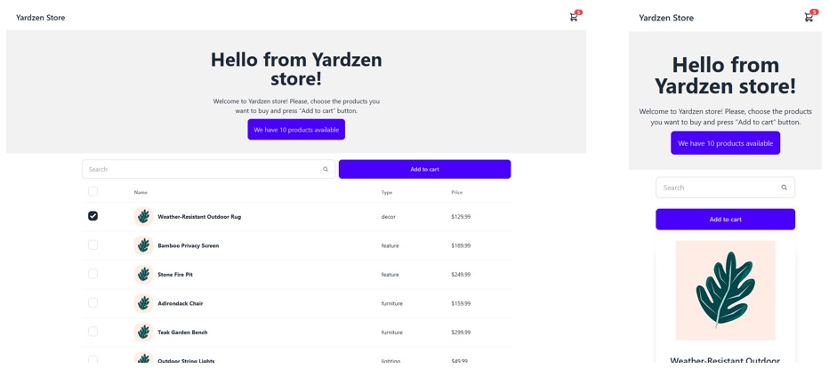

# Yardzen Coding Challenge

## My comments
Hello Yardzen team, I'm Christian Barreto (Howdy) and I'm happy to submit this test for your evaluation. Please fell free to ask me anything you find necessary on:

**christiannabasbarreto@gmail.com**
**+55 22 981111706**


See below some notes about this project.

## Notes:
I worked to implement all requirements described on the next topics, see below a table with a summary:



Item Display
- **(DONE)** Fetch and display items with prices via API
- **(DONE)** Group items by their types
- **(DONE)** Frontend must fetch data through API endpoints (no direct database access)

Item Selection
- **(DONE)** Users can check/uncheck items on the frontend
- **(DONE)** Selected items can be added to cart

Cart Management
- **(DONE)** "Add to Cart" button adds checked items to cart
- **(DONE)** Only one cart should exist in the database
- **(DONE)** Cart should be upserted on each "Add to Cart" action (create if none exists, update if it does)
- **(DONE)** Ability to fetch and display cart items with total price

Stretch Goals
- **(DONE)** Implement filtering/search functionality
- **(DONE)** Make the application mobile responsive
- **(DONE)** Add product images

## Other considerations
I made some commends on code that explains some decisions made, please search for "NOTE" then you will find them.

## Overview

Welcome to the Yardzen Full-Stack Coding Challenge! This exercise is designed to evaluate both your frontend and backend development skills while building something fun and practical. The challenge is designed to take approximately 2-4 hours to complete.

## Project Description

You'll be building a full-stack shopping cart application. On the frontend, users will be able to select items from a catalog and add them to their cart. On the backend, you'll create the API endpoints and database interactions to support these operations. The application will display items grouped by their types, manage cart state, and calculate totals.

## Technical Requirements

### Core Technologies

Frontend:

- React
- TypeScript
- Modern CSS approaches

Backend:

- Node.js
- Express or NestJS
- TypeScript
- SQL database (provided via Docker)

### Setup Requirements

- Docker (for running the provided database)
  - Docker Desktop version 2.2.0.0 or later
  - Docker Engine version 19.03.0 or later
  - Docker Compose version 1.25.0 or later
- Node.js v22.12.0 (LTS) or later
- pnpm

## Getting Started

1. Clone this repository

```bash
git clone https://github.com/Yardzen-Inc/coding-challenge && cd coding-challenge
```

2. Install dependencies

```bash
pnpm install
```

3. Start the database

```bash
pnpm compose
```

> **Note:** Wait about 10 seconds for PostgreSQL to fully initialize before proceeding to the next step.

4. Initialize the database

```bash
# Generate the Prisma client
pnpm db:generate

# Push the schema to database
pnpm db:push

# Seed the database with sample products
pnpm db:seed
```

5. Start development servers

```bash
pnpm dev
```

This will start:

- Frontend (Next.js): http://localhost:3000
- Backend (NestJS): http://localhost:3333

To view and manage the database through a GUI:

```bash
pnpm db:studio
```

This will open Prisma Studio at http://localhost:5555

## Sample Data

The database will be seeded with sample outdoor products including:

- Furniture (benches, chairs)
- Plants and planters
- Lighting fixtures
- Outdoor features (fire pit, privacy screen)
- Decorative items

## Project Structure

This is a monorepo using Nx for workspace management:

- `apps/web`: Next.js frontend application
- `apps/api`: NestJS backend application
- `packages/database`: Prisma schema, client, and database utilities

## Acceptance Criteria

### Core Requirements

1. Item Display

   - Fetch and display items with prices via API
   - Group items by their types
   - Frontend must fetch data through API endpoints (no direct database access)

2. Item Selection

   - Users can check/uncheck items on the frontend
   - Selected items can be added to cart

3. Cart Management
   - "Add to Cart" button adds checked items to cart
   - Only one cart should exist in the database
   - Cart should be upserted on each "Add to Cart" action (create if none exists, update if it does)
   - Ability to fetch and display cart items with total price

### Stretch Goals

If you have time remaining and would like to continue, you may consider the following:

- Implement filtering/search functionality
- Make the application mobile responsive
- Add product images

## Submission Guidelines

Please submit your completed challenge using one of the following methods:

1. Public GitHub Repository

   - Create a new public repository
   - Push your solution
   - Share the repository URL with us

2. Private GitHub Repository

   - Create a new private repository
   - Add [`engineering@yardzen.com`](mailto:engineering@yardzen.com) as a collaborator
   - Share the repository URL with us

3. ZIP Archive
   - Create a ZIP archive of your project directory
   - Exclude the `node_modules` directory
   - Email the ZIP file to [`engineering@yardzen.com`](mailto:engineering@yardzen.com)
